# Selenium BDD Framework

🔹 **Overview**
This repository contains a BDD-based Selenium Automation Framework designed for scalable and modular test automation. The framework is built using Java, TestNG, Cucumber, and Extent Reports, and includes several supporting utility layers.

Key Features:

✅ Developed using Java, with TestNG and Cucumber for BDD-style testing
📊 Integrated with Extent Reports for detailed and visual reporting
🧩 Designed for scalability and modularity, promoting reusability and easy maintenance
🧪 Includes a utility layer for:

    * Reporting and logging
    * Email notifications for test summary or failure alerts
    * Environment-specific configuration handling
    * Test result tracking and monitoring

📁 Project Structure Overview

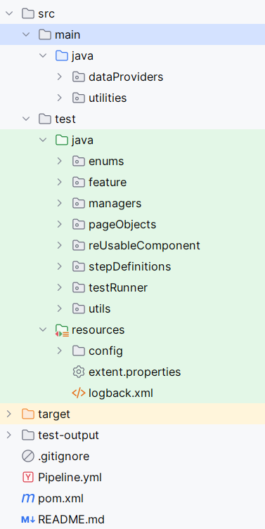

✅ How to Execute the Framework
The automation framework provides multiple ways to execute test scenarios efficiently.

1. Run via Test Runner Class
   
   * Navigate to the runners package (or your specific location).
   * Use the main Test Runner file (TestRunner.java) to execute all scenarios.
   * Supports tagged execution (e.g., @sanity, @regression, etc.).

2. Run Failed Test Scenarios

   * In case of failures, the framework automatically captures failed scenarios.
   * A separate Failed Test Runner file (FailedTestRunner.java) is provided to rerun only failed test cases.
   * Helps in saving time during re-execution.

3. Run via Maven Command
   
   * You can execute the test suite using Maven CLI with the following command:
     mvn clean test
     mvn clean test -Dcucumber.filter.tags="@sanity"

TestRunner File

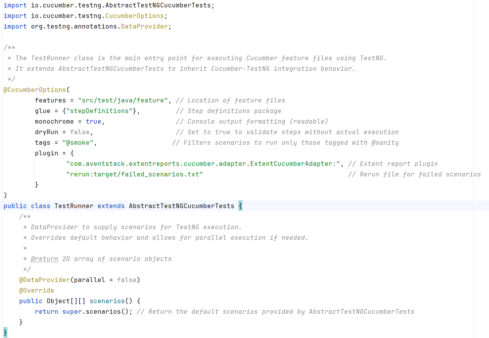

Failed Test Case Runner File

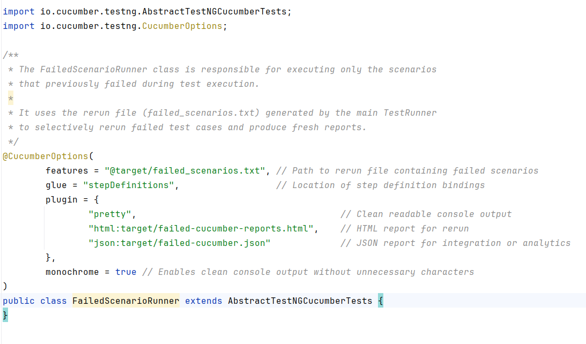

Extent Report

Report Folder

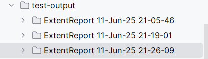

Latest Report can be visible on spark.html

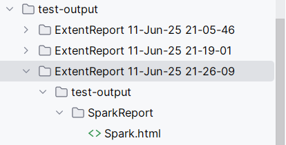

Passed Scenarios Report

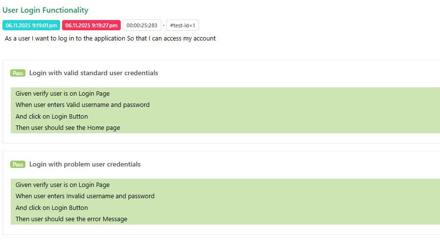

Failed Scenarios Report

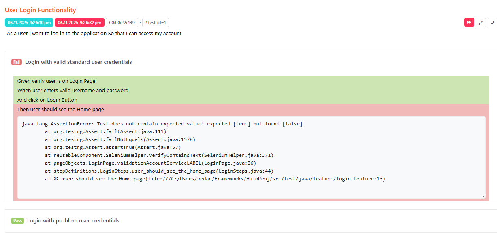

🔍 Module Details

✅ dataProviders/ConfigFileReader
    * Loads properties from configuration files like config_QA.properties.

🧪 utilities/
* EmailConnector, EmailUtil: Used to send result emails after execution.
* EnvUtility: Environment-based logic like setting up URLs.
* ReportParser: Reads and processes generated test reports.
* ScenarioContext, ScenarioResult: Track test data across scenarios.

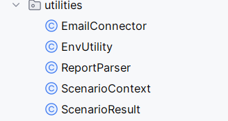

🔠 enums/EmailConstants and LoginPageConstants
    * Holds enums/constants used for sending reports or emails.

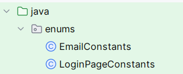

🧠 managers/
    * FileReaderManager: Central access point for config file and other data readers.
    * PageObjectManager: Lazy initialization and management of Page Object instances.

🌐 pageObjects/
    * Contains Page Object Model (POM) classes for your web elements and actions.

🧰 reUsableComponent/SeleniumHelper
    * Provides utility functions for Selenium WebDriver actions (clicks, waits, etc.)

🧷 utils/
    * BaseTest: Initializes browser, driver, and sets up before each test.
    * TestContextSetup: Manages the shared state across step definitions and hooks.

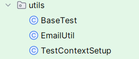

🧪 stepDefinitions/
    * Implements Gherkin step logic using Selenium and helper methods.

🏃 testRunner/
    * TestRunner: Primary test execution class with TestNG.
    * FailedScenarioRunner: Runs only the failed scenarios.

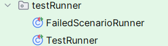

🏃 feature/
* feature: All Feature File with be the part using Gherkins Language

⚙️ Configuration Files

Located in src/main/resources/config/:

    * config_QA.properties: Stores environment-specific variables like base URL.
    * email.properties: SMTP and email-related configurations.
    * extent.properties: Config settings for Extent Reports.
    * logback.xml: Logging configuration for console/file logging.

Below are the Detailed Class Structure
--------------------------------------------------------------------------------------------------------------------------
🔹 **Class Name: ConfigFileReader**

Purpose:
This class is responsible for reading environment-specific configuration and email property files. It provides utility methods to retrieve values like URLs, credentials, browser type, and timeouts based on the current test environment (QA, Dev, etc.).

🔍 Constructor

public ConfigFileReader()

Function: 
Initializes the reader by detecting the test environment (like QA or DEV), locating the corresponding .properties file (config_<env>.properties), and loading it for use in the test framework.

✅ General Configuration Methods

| Method                           | Return Type | Purpose                                                                                                    |
| -------------------------------- | ----------- | ---------------------------------------------------------------------------------------------------------- |
| `getProperty(String key)`        | `String`    | Returns a value from the environment-specific config file for the given key. Throws an error if not found. |
| `getIntProperty(String key)`     | `int`       | Returns a property as an integer.                                                                          |
| `getLongProperty(String key)`    | `long`      | Returns a property as a long number.                                                                       |
| `getBooleanProperty(String key)` | `boolean`   | Returns a property as a boolean (true/false).                                                              |

🌐 Environment-Specific Getters
These methods simplify access to commonly used test configurations:

| Method                 | Return Type | Returns                                                  |
| ---------------------- | ----------- | -------------------------------------------------------- |
| `getUrl()`             | `String`    | The target application URL from config.                  |
| `getBrowser()`         | `String`    | Browser type for test execution (e.g., Chrome, Firefox). |
| `getValidUserId()`     | `String`    | A valid test user ID.                                    |
| `getValidPassword()`   | `String`    | The corresponding valid password.                        |
| `getInvalidUserId()`   | `String`    | An intentionally invalid user ID for negative testing.   |
| `getInvalidPassword()` | `String`    | An intentionally invalid password for negative testing.  |
| `getPageLoadTimeout()` | `int`       | Maximum time (in seconds) for a page to load.            |
| `getImplicitWait()`    | `int`       | Time (in seconds) for implicit waits used in Selenium.   |
| `getExplicitWait()`    | `int`       | Time (in seconds) for explicit waits in test flows.      |

📧 Email Configuration Methods
Email-related properties are loaded once statically from email.properties. These are commonly used for notification or reporting purposes.

| Method                         | Return Type | Purpose                                                |
| ------------------------------ | ----------- | ------------------------------------------------------ |
| `getEmailProperty(String key)` | `String`    | Generic method to get an email config property.        |
| `getEmailUserName()`           | `String`    | Returns the email username for test automation emails. |
| `getEmailPassword()`           | `String`    | Returns the corresponding password.                    |

⚙️ Environment Handling (via Utility)
1. EnvUtility.getTestEnvironment() (external call): Determines the environment (like QA, DEV, PROD) based on system or pipeline variable.

🛡️ Error Handling
1. If the config file or email properties file is missing, or a property key is not found, the system will throw a RuntimeException with a clear message.
2. This helps in quickly identifying misconfigurations during test execution.

--------------------------------------------------------------------------------------------------------------------------

🔹 **Class Name: FileReaderManager**
Purpose:
This class acts as a centralized access point for configuration readers in the test automation framework. It follows the Singleton design pattern to ensure only one instance of the configuration reader (ConfigFileReader) is used throughout the test lifecycle.
This helps maintain consistency across all tests and avoids unnecessary reloading of configuration data.

🔍 Constructor
private FileReaderManager()
Function:
A private constructor to prevent direct object creation from outside. It enforces the Singleton pattern, allowing the framework to maintain only one instance of this manager.

🔁 Singleton Accessor Method

| Method                                          | Return Type         | Purpose                                                                                                                    |
| ----------------------------------------------- | ------------------- | -------------------------------------------------------------------------------------------------------------------------- |
| `public static FileReaderManager getInstance()` | `FileReaderManager` | Returns the single shared instance of the `FileReaderManager` class. Enables global access without creating new instances. |

📄 Configuration Reader Access

| Method                                      | Return Type        | Purpose                                                                                                                                                             |
| ------------------------------------------- | ------------------ | ------------------------------------------------------------------------------------------------------------------------------------------------------------------- |
| `public ConfigFileReader getConfigReader()` | `ConfigFileReader` | Returns an instance of `ConfigFileReader`. If it hasn’t been created yet, a new instance is initialized. This ensures only one reader is used throughout execution. |

🛡️ Design Benefit: Singleton Pattern
This class ensures the configuration file is read once and shared across the framework, avoiding inconsistent values and improving performance.

--------------------------------------------------------------------------------------------------------------------------

🔹 **Class Name: SeleniumHelper**

🌍 Purpose:
This class acts as a utility hub for commonly used Selenium WebDriver actions. It is designed to simplify interaction with UI elements, improve test script readability, and promote code reuse across test cases.

📆 Used In:
All test flows and step definitions where web element interaction is required. Acts as a base utility for page-level actions.

🔧 Key Responsibilities:

    * Perform safe and consistent clicks using different techniques (JavaScript, Actions, WebDriver).
    * Handle synchronization using WebDriverWait for visibility or clickability.
    * Input text into fields, press keyboard keys like ENTER or ESC.
    * Verify visible text content and validate UI element counts.
    * Select options from dropdown menus via visible text, index, or value.
    * Switch between browser windows or tabs.
    * Scroll and refresh browser window.

✅ Core Functional Categories:

1. Wait Utilities

   * Wait for visibility or clickability of elements before performing actions to ensure application stability.

2. Click Actions

   * Click using WebDriver, JavaScriptExecutor, and Actions class.
   * Support conditional click with delay.

3. Input Actions

   * Enter text with or without clearing.
   * Submit forms using ENTER key.

4. Verification Functions

   * Match expected text content with actual UI values (Exact and Contains).
   * Multi-text validation supported (for dynamic UIs).

5. Dropdown Handling

   * Select dropdown options by visible text, index, or value.

6. Window Handling

   * Switch between parent and child browser windows during popups or modal usage.

7. Scroll and Navigation

   * Scroll to page bottom.
   * Refresh browser window.

📅 Business Benefits

    * Reusable: Common actions are centralized, reducing duplication.
    * Maintainable: Abstracted interactions help keep test logic clean and modular.
    * Stable: Reduces flakiness by integrating proper wait mechanisms.
    * Extensible: Easily adaptable to new UI interaction patterns.

🛡️ Error Handling

All public methods are wrapped with try-catch blocks and throw descriptive RuntimeExceptions to aid in root-cause analysis during test failures.

--------------------------------------------------------------------------------------------------------------------------

📦 **Class: EmailConnector**

Package: utilities

🔍 Purpose

The EmailConnector class is designed to establish a secure connection with a Gmail mailbox using the IMAPS protocol. It reads necessary configurations from an external properties file, allowing flexible and reusable mail setup for automated test validations or alerts.

⚙️ Features

    * Secure Connection: Utilizes the imaps protocol to establish a secure connection to Gmail.
    * External Configuration: Reads host and port details from a email.properties file to ensure environment flexibility.
    * Wait Handling: Includes configurable delay (in minutes) before establishing the connection (useful for sync/timing with email triggers).
    * Logging Support: SLF4J logging integration provides visibility into the connection process and error handling.

🔑 Parameters

    * username: Gmail email ID to log into
    * password: Gmail password or App Password (for 2FA-enabled accounts)
    * timeToWait: Time in minutes to wait before initiating the connection

📤 Output

Returns a connected javax.mail.Store object which can be used to access folders like Inbox, Sent, etc.

--------------------------------------------------------------------------------------------------------------------------

📄 **Class Name: EnvUtility**

🔍 Purpose:
The EnvUtility class provides utility methods to dynamically fetch and manage environment-specific configuration details, such as the environment name (QA, PROD, etc.) and Cucumber test tags. This ensures that the automation framework can adapt to different execution contexts without hardcoded values.

🎯 Key Responsibilities:

| Responsibility              | Description                                                                     |
| --------------------------- | ------------------------------------------------------------------------------- |
| ✅ Environment Fetching      | Automatically reads `TEST_ENV` from system properties or environment variables. |
| 🏷️ Cucumber Tag Handling   | Reads, formats, and defaults the Cucumber tag for filtered test execution.      |
| ⚙️ Environment Evaluation   | Provides boolean checks to determine if the current environment is QA or PROD.  |
| ✉️ Report Subject Generator | Dynamically builds an informative subject line for test result reports.         |

🧩 Usage Context:
This utility is used across the automation framework wherever dynamic environment configuration or report labeling is needed. It allows testers and pipelines to trigger environment-specific behaviors without modifying the codebase.

💡 Sample Use Cases:

    * Dynamically executing @smoke or @regression tests based on CI parameters.
    * Sending environment-specific automation reports.
    * Controlling test behavior (e.g., login URLs, API endpoints) using isQA() or isProd() flags.

🛠 Technical Details:

    * Utilizes Optional.ofNullable to ensure null-safe property access.
    * Falls back from system properties to environment variables.
    * Converts Cucumber tags by removing "@" and converting to uppercase.
    * Default tag is "SANITY" if none is provided.

✅ Advantages:

    * No need to hardcode environment or tag values in scripts.
    * Reduces the risk of null errors or misconfigurations.
    * Clean and centralized access to execution context settings.
    * Ideal for CI/CD integrations where parameters change per pipeline.

--------------------------------------------------------------------------------------------------------------------------

📄 **Class Name: Hooks**

🔹 Purpose
The Hooks class serves as the central lifecycle manager for the automation test execution using Cucumber. It provides structured entry and exit points for each test scenario and controls the post-execution actions like collecting results and dispatching the summary report via email.

🔹 Key Responsibilities

    * Scenario Lifecycle Management
    * Captures and stores each running test scenario for potential real-time logging and reporting.
    * Identifies and tracks the executing feature file to enable context-specific reporting.
    * Test Execution Results Tracking
    * Collects the result (PASSED or FAILED) for every scenario.
    * Maintains a centralized repository (scenarioResults) of all executed test scenarios.
    * Provides summary-level metrics: total scenarios, pass/fail counts, and failed scenario details.
    * Post Execution Email Notification
    * After all tests are executed, a shutdown hook triggers the post-execution flow.
    * Connects to the configured Gmail account and sends a summary email including:
    * Total scenarios executed
    * Count of passed and failed scenarios
    * List of failed test names
    * Attached test execution report

🔹 Integration Points

    * ScenarioContext Utility: Used to store and retrieve the currently executing feature name.
    * ScenarioResult Model: Used to create and store scenario result snapshots.
    * EmailConnector: Handles secure connection to Gmail via IMAP.
    * EmailUtil: Manages email composition and sending of reports.
    * FileReaderManager: Fetches secure credentials and configurations from the central property manager.

🔹 Execution Flow

    * Before Each Scenario
    * Capture the Cucumber Scenario object.
    * Derive and store the current feature name from the scenario's URI.
    * After Each Scenario
    * Store the result (name + status) into the scenario results list.
    * After All Scenarios
    * Triggered via JVM shutdown hook.
    * Reads Gmail credentials.
    * Connects to Gmail and sends an execution report to predefined recipients.

🔹 Client Value Proposition 

    * Enables real-time tracking and reporting of test execution across features.
    * Automatically sends test results post-execution — no manual intervention required.
    * Seamlessly integrates with utility classes for maintainable and scalable automation architecture.

--------------------------------------------------------------------------------------------------------------------------

📄 **Class Name: TestRunner**

🔹 Purpose
    The TestRunner class serves as the main trigger point for running BDD test scenarios written in Cucumber, integrated with the TestNG framework. It ensures that only desired scenarios (tagged with @sanity) are executed and that result reports are automatically generated.

🔹 Key Features

    * Feature Path Configuration
    * Specifies the location of .feature files to be executed:
    * src/test/java/feature.

Glue Code Binding

    Connects the .feature steps to their respective Java implementations located in:
    stepDefinitions.

Tag Filtering

    * Executes only those scenarios marked with the @sanity tag, allowing flexible suite segmentation.

Plugins Integration

    * Extent Reports: Automatically generates HTML reports for executed tests.
    * Rerun File: Stores failed scenarios in target/failed_scenarios.txt for easy re-execution.

Execution Format

    * monochrome=true provides clean, readable output on the console.
    * dryRun=false ensures the test suite actually executes rather than performing just step validations.

🔹 Parallel Execution Handling

    The class overrides the scenarios() method from the parent class using a @DataProvider. While currently configured with parallel = false, it can be easily adapted for parallel test execution by setting it to true.

🔹 Client Value Proposition

    * Focused test runs with tag-based filtering (e.g., @sanity, @regression, etc.)
    * Fully integrated with test reporting tools like Extent Reports
    * Supports automated rerun of failed tests to improve reliability
    * Easy adaptation to parallel test execution for faster feedback cycles

--------------------------------------------------------------------------------------------------------------------------

📄 **Class Name: FailedScenarioRunner**

🔹 Purpose
The FailedScenarioRunner class is dedicated to rerunning only those Cucumber scenarios that failed during the previous test execution. It enables a more efficient and focused re-validation of failed tests without re-running the entire suite.

🔹 Key Features

    * Input from Rerun File
    * The class consumes the @target/failed_scenarios.txt file to pick up and re-execute failed scenarios only.

Glue Path Configuration

    * Ensures seamless execution by pointing to the correct step definitions under the stepDefinitions package.

Multi-format Reporting

    * pretty: Displays clean and easy-to-read logs in the console.
    * HTML Report: Generates an HTML summary (failed-cucumber-reports.html) in target directory.
    * JSON Report: Creates failed-cucumber.json, useful for integrations with dashboards or report parsers.

Monochrome Output

    * Ensures cleaner logs by avoiding ANSI escape characters, improving CI/CD readability.

🔹 Use Case & Value

    * Ideal for Rerun Execution Strategy: Instead of re-running the full suite, the framework re-executes only failed test cases.
    * Saves execution time and resources in large-scale automation pipelines.
    * Helps QA teams identify consistent failures vs. flaky tests quickly.

🔹 Client Value Proposition

    * Improves test efficiency by eliminating redundant test runs.
    * Provides focused reports and logs for faster root-cause analysis.
    * Seamlessly integrates with CI/CD pipelines for nightly reruns or quick defect fix validation.

--------------------------------------------------------------------------------------------------------------------------

📄 **Class Name: BaseTest**

🔹 Purpose
The BaseTest class is a core utility that sets up and initializes the WebDriver, which is responsible for launching and managing the browser during automation test execution. This class ensures that each browser session is created consistently and according to the client’s environment configuration.

🔹 Key Features
Multi-browser Support

    Supports Chrome, Firefox, Edge, Headless Chrome.
    Emulates mobile device (e.g., iPhone resolution) for responsive UI testing.

Browser Configuration

    Automatically maximizes the window on launch.
    Deletes all cookies to ensure a clean session.
    Accepts insecure SSL certificates (useful for testing environments).

Timeout Handling

    Configurable implicit wait and page load timeout fetched from external configuration.
    Ensures stability for dynamic or slow-loading applications.

Device Emulation (Mobile View)

    Uses Dimension to resize the browser to simulate mobile screen resolutions (e.g., iPhone).

🔹 Use Case & Value

    * Centralized control for WebDriver configuration across the automation framework.
    * Simplifies management of browser-specific test setups without modifying test logic.
    * Helps enforce standard browser settings in every run, reducing flaky test behavior.

🔹 Client Value Proposition

    * Modular and Scalable: New browsers or configurations can be easily added.
    * Cleaner Debugging: Unified place to manage WebDriver, making root cause analysis simpler.
    * Adaptable for CI/CD: Works seamlessly with cloud/grid infrastructure and pipeline executions.
    * Responsive Testing Ready: Built-in mobile resolution support for responsive UI validations.

--------------------------------------------------------------------------------------------------------------------------

📄 **Class Name: EmailUtils**

🔍 Purpose
The purpose of the EmailUtil module is to automatically send a detailed summary email upon the completion of test execution. This ensures that stakeholders receive immediate and clear feedback regarding test outcomes.

🧩 Key Capabilities

Automated Execution Summary

    * Sends an email upon test suite completion, summarizing:
        * Total number of scenarios executed
        * Count of passed and failed scenarios
        * Percentage success and failure rates

Environment-Specific Details

    * Mentions which environment (QA, UAT, Prod, etc.) was used during the run.
    * Also includes which test suite/tag was executed (e.g., @sanity, @regression).

Failed Scenario Listing

    * If any test scenario fails, it is listed in the email for quick visibility and tracking.

Time-Stamped Subject Line

    * Each email subject includes the execution timestamp for quick reference and filtering.

Styled HTML Email Body

    * The email includes branding, visual styling, and color-coded results for readability.
    * Emojis are used in the internal version to make summaries easily scannable (can be omitted for external client delivery if needed).

Attachment: Execution Report

    * Attaches the full HTML test report generated from automation execution.
    * The report includes detailed steps, screenshots, and logs (if implemented in the framework).

📦 Technology & Integration

    * Emails are sent using Gmail SMTP (configured securely using an app password).
    * Report files are dynamically identified from the latest test execution.
    * Supports all email providers that allow SMTP with authentication and TLS.

📬 Recipients

    * The list of recipients is configurable and maintained centrally.
    * Can be easily updated without changing the core code logic.

✅ Client Benefits

    * Faster Feedback Loop – Get automated test results without waiting for manual updates.
    * Improved Transparency – Clear visibility of failed test cases and summary stats.
    * Time-Saving – Automatically generated email eliminates manual reporting efforts.
    * Customizable – Easily extendable to include logs, screenshots, and build info.
      
--------------------------------------------------------------------------------------------------------------------------